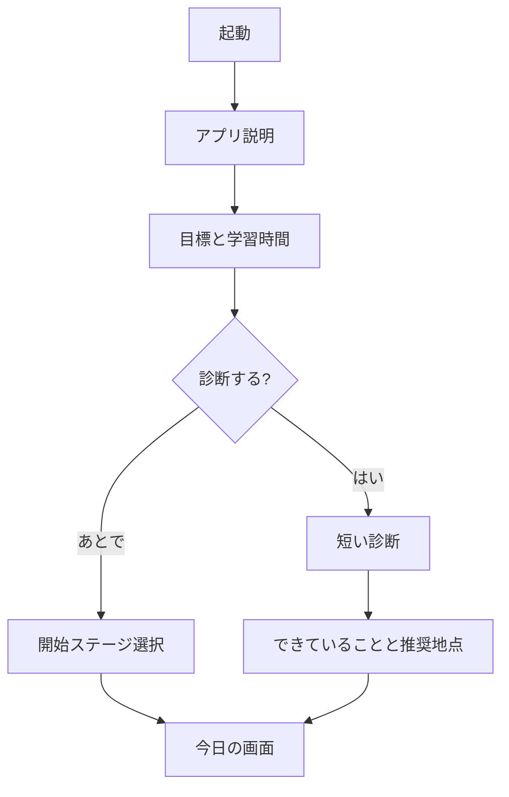
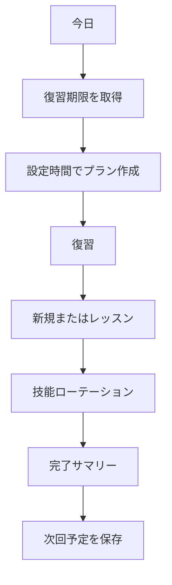
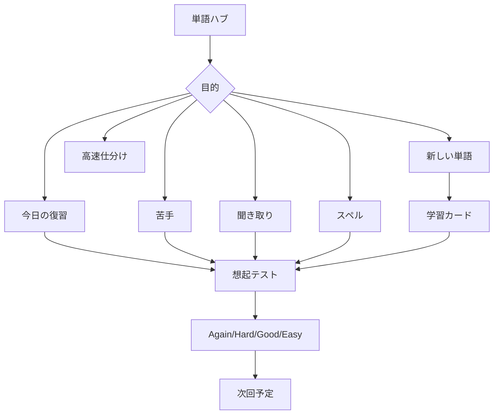

# 04. Information Architecture

## 1. グローバルナビゲーション

スマートフォンでは下部5タブを基本とする。

1. **今日**
2. **コース**
3. **単語**
4. **練習**
5. **記録**

設定、バックアップ、ヘルプは右上のプロフィール／設定ボタンから開く。

## 2. ルート案

静的ホスティング互換性のため、初期版はHash Routerを推奨する。

```text
/#/                         今日
/#/onboarding              初回設定
/#/diagnostic              初期診断
/#/course                  コースマップ
/#/course/stage/:stageId   ステージ詳細
/#/lesson/:lessonId        レッスン
/#/vocabulary              単語ハブ
/#/vocabulary/session      単語セッション
/#/vocabulary/:wordId      単語詳細
/#/review                  復習ハブ
/#/practice                技能練習
/#/practice/reading        読解
/#/practice/listening      リスニング
/#/practice/writing        ライティング
/#/practice/speaking       スピーキング
/#/mock                    模擬演習
/#/progress                学習記録
/#/settings                設定
/#/settings/data           データ管理
/#/help                    ヘルプ
```

## 3. 主要ユーザーフロー

### 初回



### 毎日の学習



### 単語集中



## 4. 「今日」画面の情報優先順位

1. 今日の残り時間と完了率
2. 復習期限数
3. 大きな開始ボタン
4. 軽め／標準／しっかり切替
5. 今日の内訳
6. 今週の重点
7. 最近の達成

ホーム画面に過剰なグラフを詰め込まない。

## 5. 画面間の戻る動作

- 学習セッション中の戻る操作では、進捗保存と中断確認を行う。
- ブラウザー戻るでもデータを失わない。
- モーダルを多用せず、フルスクリーン学習画面は専用ルートにする。

## 6. オフライン時のナビゲーション

- 利用可能な機能は通常表示する。
- 未ダウンロード音声等だけにオフラインマークを付ける。
- 全画面を「オフラインなので使えない」にしない。
- ネットワークが戻ったとき自動でUI状態を更新する。
