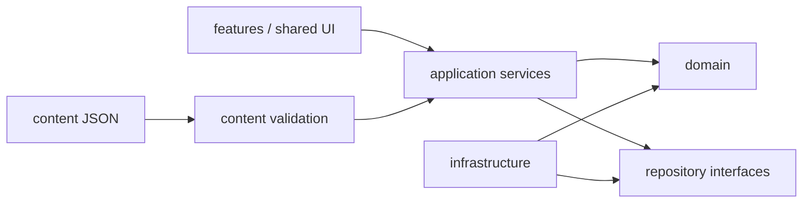

# 07. Technical Architecture

## 1. 技術スタック

実装時点の安定版を使い、プレリリースは避ける。

| 領域 | 採用方針 |
|---|---|
| UI | React + TypeScript |
| Build | Vite |
| Routing | React Router。静的ホスティング互換のHash Routerを基本 |
| Persistence | IndexedDB + Dexie |
| Validation | Zodまたは同等の型連携可能なスキーマ |
| Date/Time | date-fns等。ローカル日付処理を明示 |
| PWA | vite-plugin-pwa等を利用してよいが、生成物を理解し検証する |
| Tests | Vitest、Testing Library、Playwright、fake-indexeddb |
| Accessibility | axe-core系をテストへ追加可能 |
| Styling | CSS Modules + CSS Custom Propertiesを推奨 |
| Icons | ライセンス確認済みのSVGアイコンライブラリまたは自作SVG |

## 2. アーキテクチャ原則

### Domain first

復習計算、日次プラン、習熟度更新、診断判定は純粋TypeScript関数とする。React、Dexie、ブラウザーAPIを直接参照しない。

### Repository boundary

IndexedDBアクセスはrepository経由にする。UIコンポーネントからDexieテーブルを直接触らない。

### Content as data

レッスンや問題はJSXへ埋め込まず、バージョン付きコンテンツデータとして扱う。

### Capability detection

録音、音声合成、インストールプロンプト、永続ストレージ等は機能検出し、非対応時に代替を出す。

### Offline first

ネットワークを前提に回答処理や画面遷移を作らない。

## 3. 推奨ディレクトリ

```text
src/
├─ app/
│  ├─ App.tsx
│  ├─ router.tsx
│  ├─ providers/
│  └─ startup/
├─ domain/
│  ├─ curriculum/
│  ├─ diagnostic/
│  ├─ learning/
│  ├─ mastery/
│  ├─ planning/
│  ├─ review/
│  └─ backup/
├─ infrastructure/
│  ├─ db/
│  │  ├─ appDb.ts
│  │  ├─ migrations.ts
│  │  └─ repositories/
│  ├─ content/
│  │  ├─ loader.ts
│  │  ├─ schemas.ts
│  │  └─ seed.ts
│  ├─ audio/
│  ├─ recording/
│  └─ pwa/
├─ features/
│  ├─ onboarding/
│  ├─ diagnostic/
│  ├─ today/
│  ├─ course/
│  ├─ lesson/
│  ├─ vocabulary/
│  ├─ review/
│  ├─ reading/
│  ├─ listening/
│  ├─ writing/
│  ├─ speaking/
│  ├─ mockExam/
│  ├─ progress/
│  └─ settings/
├─ shared/
│  ├─ components/
│  ├─ hooks/
│  ├─ styles/
│  ├─ utils/
│  └─ types/
├─ content/
│  ├─ packs/
│  └─ index.ts
└─ test/
```

## 4. 依存方向



禁止:

- domain → React
- domain → Dexie
- domain → `window`
- content JSON → 実行可能コード

## 5. アプリ起動シーケンス

1. PWA更新状態を確認
2. IndexedDBを開く
3. DB migration
4. App metaとコンテンツバージョンを確認
5. バンドル教材を検証
6. 必要ならコンテンツをseed/update
7. User profileとsettingsをロード
8. 不完全なstudy sessionを回復
9. ルーターを表示

起動失敗時は白画面にせず、復旧画面を表示する。

## 6. Application services案

- `OnboardingService`
- `DiagnosticService`
- `CurriculumService`
- `LessonProgressService`
- `ReviewSchedulerService`
- `ReviewQueueService`
- `DailyPlanService`
- `MasteryService`
- `ProgressAggregationService`
- `BackupService`
- `ContentPackService`
- `AudioService`
- `RecordingService`

サービスは必要以上にクラス化せず、純粋関数と小さな協調オブジェクトを使う。

## 7. 状態管理

- 永続状態の正本はIndexedDB
- Reactのローカル状態は画面操作
- 全アプリの軽量UI状態だけContextまたは小型storeを使う
- 学習履歴全体をグローバルstoreへ複製しない
- Dexieのlive query等を使う場合もrepository境界を維持する

## 8. 日付・時刻

復習は時刻と学習日を区別する。

- `dueAt`: ISO日時
- `studyDate`: ユーザーのローカル日付 `YYYY-MM-DD`
- `timezone`: IANA名が取得できる場合は保存
- 10分後復習は日時で管理
- 翌日以降はローカル学習日の開始時刻を基準にする

端末時計が大きく巻き戻った場合は警告し、負の経過時間を0へ丸める。

## 9. エラー処理

- ドメインエラーは識別可能なコードを持つ
- ユーザー向け文言と開発者向け詳細を分ける
- 回答保存失敗時はメモリキューへ保持し、再試行する
- コンテンツ1件の不備で全アプリを起動不能にしない。無効項目を隔離し、診断情報を表示する
- 復元はトランザクションで実行し、途中失敗で半端な状態を残さない

## 10. パフォーマンス

- ルート単位でコード分割
- 大きな教材パックと音声は遅延読み込み
- 一覧は必要に応じて仮想化するが、少量段階では過剰実装しない
- 集計は毎renderで全履歴を走査しない
- 集計キャッシュを持つ場合、原データから再構築可能にする

## 11. ブラウザーサポート

目標:

- 最新2世代程度のChrome / Edge / Firefox / Safari
- iOS Safariおよびホーム画面追加PWA
- Android Chrome PWA

すべてのブラウザーで同一のインストールUIを要求しない。主要な学習機能とデータ保存を優先する。
