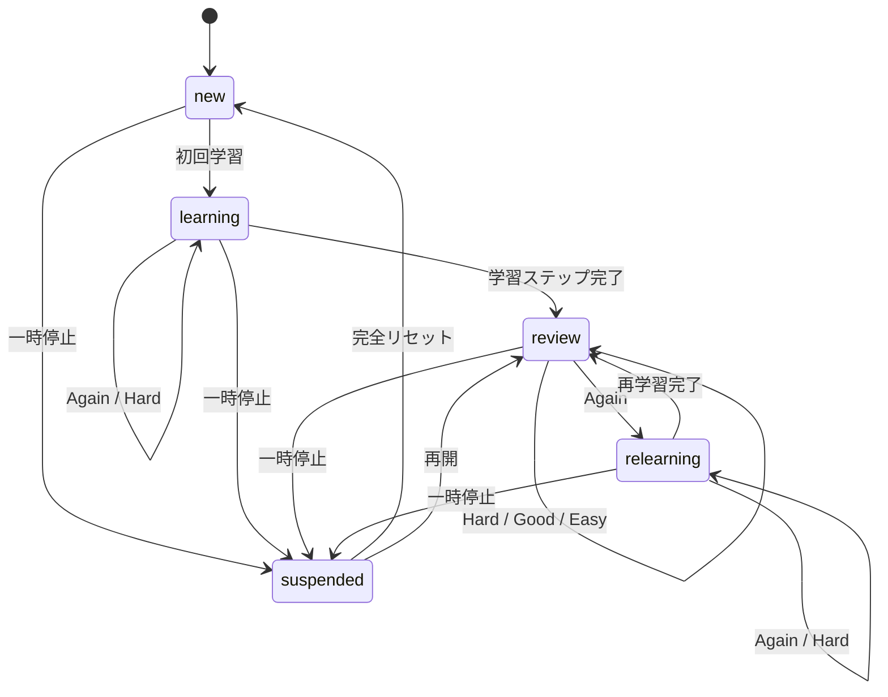

# 09. Review Algorithm

## 1. 目的

この復習機能は、エビングハウス型の「学習直後は忘れやすく、その後は忘却が緩やかになる」という考え方を、実装可能な間隔反復へ落とし込む。

ただし、特定の「20分後に何％忘れる」という値を全ユーザーへ断定適用しない。実際の予定は回答履歴で調整する。

## 2. 設計上の役割分担

- **固定の初期ステップ**: 新規項目の最初の数回を安定させる
- **適応的なレビュー間隔**: 正誤、速度、ヒント、自信度で調整
- **予測保持率**: キューの優先順位と表示用。公式な記憶測定値ではない
- **バックログ制御**: 復習量が破綻しないよう新規導入を抑制

## 3. 状態遷移



## 4. 初期学習ステップ

既定:

```ts
const LEARNING_STEPS = [
  { kind: 'minutes', value: 10 },
  { kind: 'days', value: 1 },
  { kind: 'days', value: 3 }
] as const;
```

ステップ完了後の初回review intervalは7日。

### learning中の評価

| 評価 | 処理 |
|---|---|
| Again | step 0へ。10分後。同一セッション末尾にも再挿入 |
| Hard | 現在stepを維持し、現在待ち時間の約1.5倍。最低30分 |
| Good | 次stepへ。最後ならreviewへ移行し7日 |
| Easy | learningを卒業し14日 |

同一セッションが10分未満で終了する場合、Again項目は最低3問以上を挟んで再出題する。

## 5. relearningステップ

review中にAgainとなった場合:

```ts
const RELEARNING_STEPS = [
  { kind: 'minutes', value: 10 },
  { kind: 'days', value: 1 }
] as const;
```

卒業時のintervalは `max(2, previousInterval * 0.35)` 日。

## 6. review中の間隔計算

MVPは透明でテストしやすいヒューリスティックを使う。

### 6.1 基本倍率

```ts
const RATING_MULTIPLIER = {
  again: 0.25,
  hard: 1.2,
  good: 2.0,
  easy: 3.0
} as const;
```

### 6.2 補正

```ts
const SPEED_FACTOR = {
  fast: 1.15,
  normal: 1.0,
  slow: 0.85
} as const;

const CONFIDENCE_FACTOR = {
  none: 0.75,
  low: 0.85,
  medium: 1.0,
  high: 1.1
} as const;

const HINT_FACTOR = {
  0: 1.0,
  1: 0.85,
  many: 0.7
} as const;
```

### 6.3 計算

```ts
rawInterval = previousInterval
  * ratingMultiplier
  * speedFactor
  * confidenceFactor
  * hintFactor
  * easeBias;
```

- `easeBias` 初期値1.0、範囲0.75〜1.3
- Againで `easeBias -= 0.08`
- Hardで `easeBias -= 0.03`
- Goodで変化なし
- Easyで `easeBias += 0.04`
- 0.75〜1.3へclamp

### 6.4 丸めと上限

- 1日未満のreview intervalは1日
- 30日未満は整数日へ丸める
- 30日以上は2〜5日単位の自然な丸めを許容
- 上限180日
- 同一項目のdue時刻が深夜へ偏らないよう、翌日以降はユーザーの学習日開始時刻へ正規化

### 6.5 Again

Againは倍率計算で次回日を決めるだけでなく、必ずrelearningへ移行する。

## 7. 回答速度の判定

問題形式ごとに期待時間を持つ。

例:

| 形式 | fast | normal上限 |
|---|---:|---:|
| 英→日 四択 | 2.5秒未満 | 8秒 |
| 日→英 四択 | 4秒未満 | 12秒 |
| タイピング | 6秒未満 | 20秒 |
| 例文穴埋め | 8秒未満 | 25秒 |
| 聞き取り | 音声終了+2秒 | 音声終了+10秒 |

アクセシビリティ設定またはユーザー傾向により、速度補正を無効化できる。遅いこと自体を罰する表示はしない。

## 8. 推奨評価の算出

```text
不正解                         -> Again
正解 + 複数ヒント              -> Hard
正解 + 自信なし                -> Hard
正解 + 極端に遅い              -> Hard
正解 + 通常                    -> Good
正解 + ヒントなし + 高自信 + 速い -> Easy候補
```

推奨は自動表示するが、ユーザーが変更できる。

## 9. 予測保持率

レビューキューの優先順位用に次を使う。

```ts
predictedRetention = Math.pow(0.9, elapsedDays / Math.max(intervalDays, 0.25));
```

これは「現在のintervalを90%保持の安定期間とみなす」製品内ヒューリスティックであり、実測値や医学的評価ではない。

表示は細かい百分率ではなく、原則として次の4段階。

- 安定
- そろそろ復習
- 本日復習
- 忘却リスク高

開発者向け詳細画面では推定値を表示してもよいが、「推定」と明記する。

## 10. キュー優先度

```ts
priority =
  riskScore * 0.45 +
  overdueScore * 0.25 +
  lapseScore * 0.15 +
  examImportanceScore * 0.10 +
  userPinnedScore * 0.05;
```

### riskScore

`1 - predictedRetention`

### overdueScore

期限超過日数を現在intervalで正規化し0〜1へclamp。

### lapseScore

`min(lapseCount / 5, 1)`

### examImportanceScore

上位ステージかつ頻出テーマ、または現在のコースに直結する項目へ0〜1。

### userPinnedScore

お気に入り・重点指定なら1、それ以外0。

同点ではdueAtが古いものを先にする。毎回同じ種類に偏らないよう、問題形式の軽いインターリーブを行う。

## 11. 新規導入制御

```text
if overdueReviews > 40:
  newLimit = 0
else if dueReviews > dailyCapacity * 0.7:
  newLimit = min(configuredLimit, 3)
else:
  newLimit = configuredLimit
```

ユーザーは手動で新規学習できるが、復習が多い旨を知らせる。

## 12. バックログ救済

表示例:

```text
復習待ち 84件

軽め       15件 / 約5分
標準       30件 / 約10分
しっかり   50件 / 約18分
すべて     84件 / 約30分
```

軽めを選んでも残りを「失敗」扱いしない。優先度の高い項目から処理し、未選択分は翌日以降へ残す。

## 13. 習熟度更新

各問題は対象dimensionを指定する。

基礎delta:

| 結果 | delta |
|---|---:|
| 正解・ヒントなし | +8 |
| 正解・ヒント1回 | +4 |
| 正解・複数ヒント | +2 |
| 不正解 | -6 |
| Again後の再正解 | +2 |

補正:

- fast +2
- slow 0（減点しない）
- 高自信で不正解 -2追加
- 四択recognitionだけではrecallを更新しない

0〜100へclamp。単一回答で20点以上変化させない。

## 14. 決定論とテスト

スケジューラーは現在時刻を引数で受け取り、テストで固定できるようにする。

必須テスト:

- new → learning
- learningの全評価
- reviewの全評価
- Again → relearning
- 未来時刻・負のelapsed
- うるう日・月跨ぎ・夏時間
- 上限180日
- easeBias clamp
- 同一入力で同一出力
- バックログ時の新規抑制
- 速度補正無効設定

## 15. 将来の高度化

十分な匿名化された本人データを端末内で蓄積した後、個人別パラメータ学習やFSRS系のアルゴリズムへ交換できるよう、`ReviewScheduler` インターフェースを保つ。ただしPilotではアルゴリズムを過度に複雑化しない。
